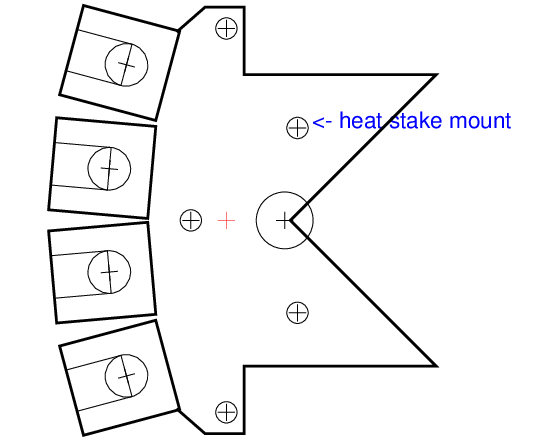
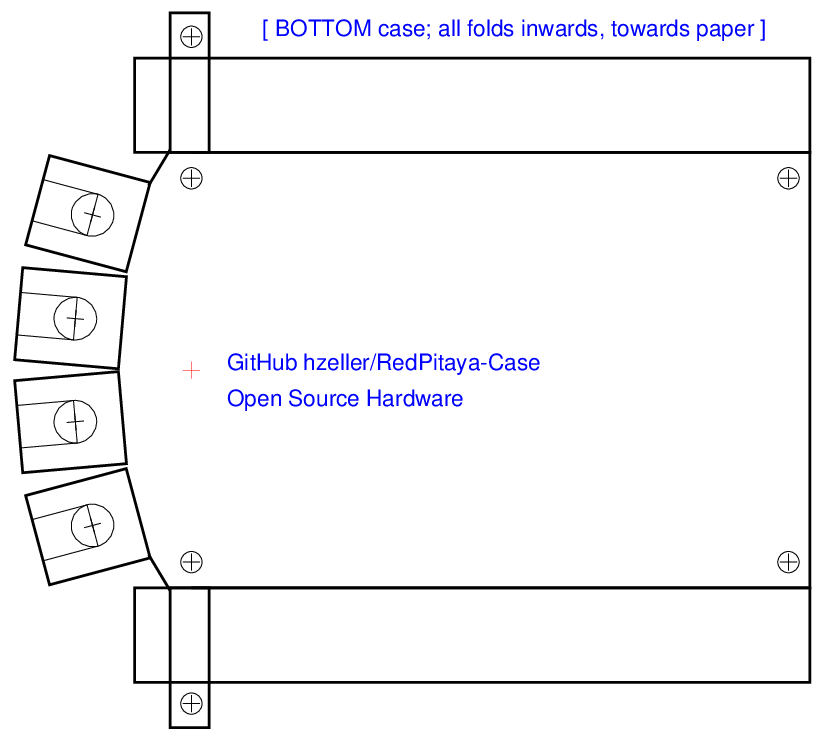
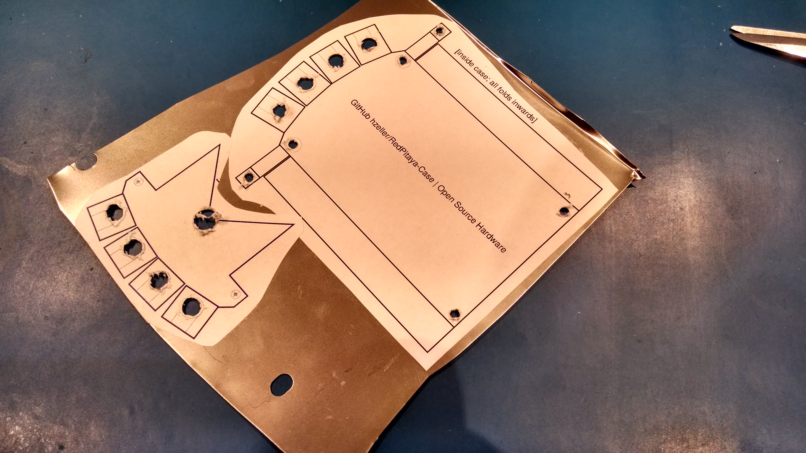
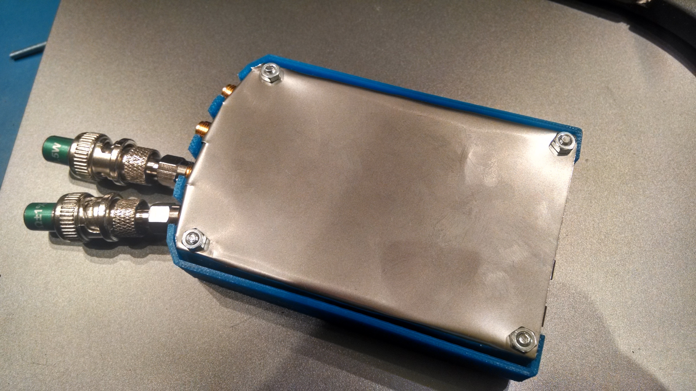
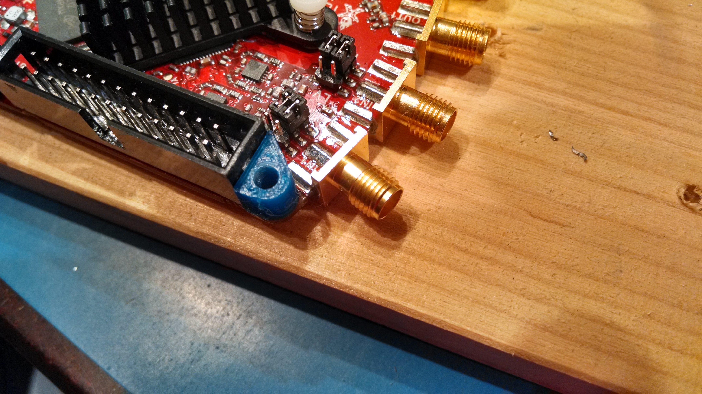
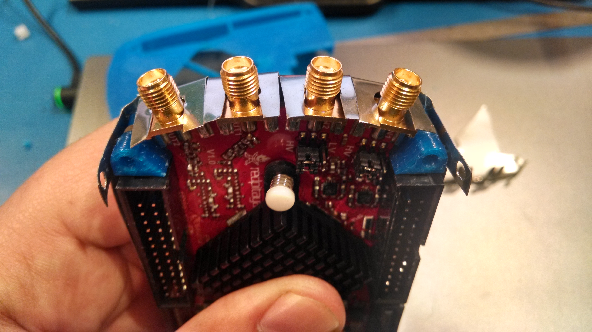
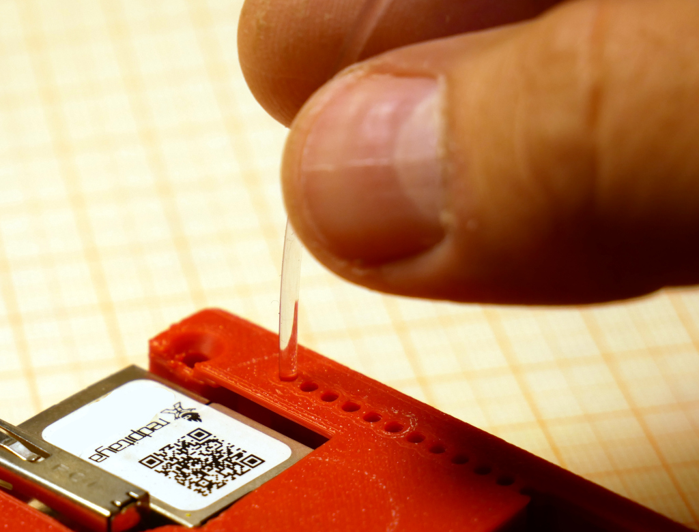
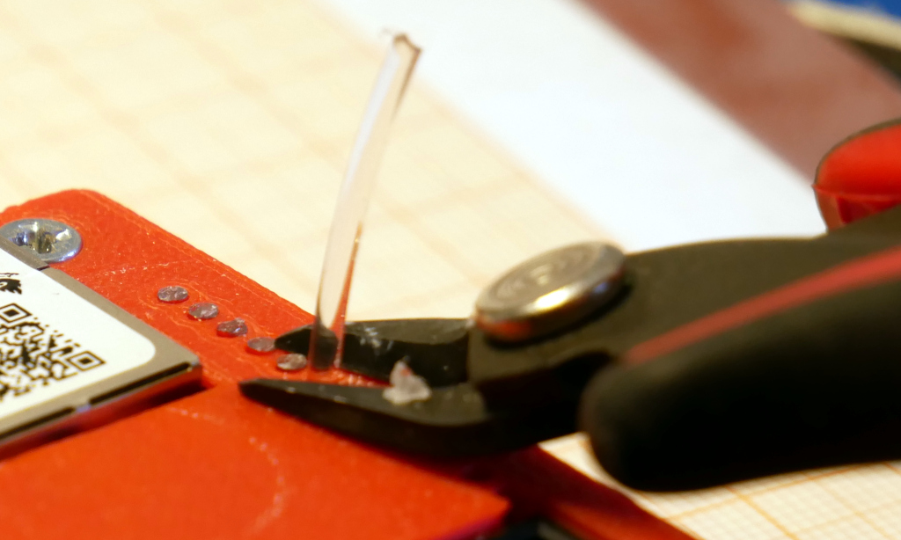
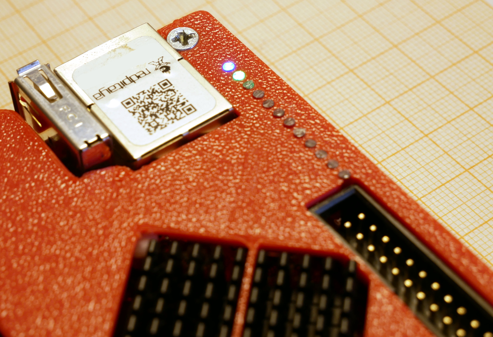

A case for the RedPitaya
------------------------

A shielded case for the scope/function generator instrument from
http://redpitaya.com/.
The bare RedPitaya is just the board and without any shielding or protective
housing - this project attempts to remedy that.
An older version of this I also have on [YouMagine][youmagine-design]
(also thingiverse 278113).

### Parts
The `shield-metal-cut.ps` PostScript file is the source for the shielding.
Print this on paper, glue on a thin (best tinned) iron shield metal (like from an old consumer device or something like a can with flat tinned metal, e.g. an empty paint thinner can) and cut out.
Make sure that your printer program output is scaled 1:1 (some PDF readers add
a margin to the page and scale the rest).
The PostScript program is hand-written, so easy to modify (essentially
poor-mans parametric 2D CAD :) ).
If you notice that your printer does not scale the output properly (there is
a line of reference length in the printout), you can correct that directly in the
program, just change the actual length in the [`/measured-reference-length`][reference-len]
variable.

If you need a DXF file, create shield-metal-cut.dxf with the Makefile (`make shield-metal-cut.dxf`). Documentation text is written in blue and shows up as
separate channel in the DXF.

Top                                   | Bottom
--------------------------------------|------------------------------------
 | 

The OpenScad file plastic-case.scad is the source for the 3D objects and the
Makefile creates the STLs to print
These are the stand-offs ([`fab-print_standoffs.stl`](./fab-print_standoffs.stl)) and the actual case ([`fab-print_case.stl`](./fab-print_standoffs.stl)); these
files are created using the Makefile and OpenSCAD, but are are included in
this distribution for easy use.

![3D Print][design]

### Assembly

#### Top Shielding
Use a center punch to mark the drill holes in the sheet metal.
Drill the holes - 3mm for screw-mounts, 8mm for SMA connectors and
around the heatsink mount.

Now cut out the shape, if you have thin enough material, a scissor should work just fine. Bend with pliers (there are instructions in which direction on the printout).

The top part of the shield will be attached with plastic heat staking: place
the top shield part on the case on the inside and make sure that it fits (the
connection across the heatsink pokes a bit into its space, cut that out).
If it fits nicely, the three plastic pins should fit through the holes and the
mounting holes right and left should align with the hole in the case.
Press down the metal and melt the plastic pins by pressing a soldering iron
on top - let cool. Now the top shielding is permanently in place. Put a bit of
electrical tape above where the jumpers are to avoid that they make accidental
contact.

#### Bottom Shielding

The large bottom shielding is also the bottom of the case.

Place the round stand-offs on the inside of your metal shield case (gluing them
in place with superglue on the metal case is a good idea, so that they don't
annoy you by falling out when needed).

The top spacers in the front is a bit triangular shaped, so that it is
possible to glue them against the 13x2 connector .. that way, you don't
have to put glue on the board itself.

Place the RedPitaya in the bottom case, with the mounting holes sitting on
top of the stand-offs (don't forget to remove the original standoffs that
come with the RedPitaya) and adjust the SMA-connector flaps if necessary.

Bend around the little screw-flaps (right and left in the image above) of the
metal case so that they sit on the triangular shaped stand-offs on top (this
might be a bit fiddely).
A good technique is -- while assembly -- to have screws push up from the
bottom of the case to have all assembly holes aligned. The screw flaps will
make sure the ground on the top case is properly connected.

If you want to really be sure of the grounding, you might want to solder a
little cable from the ground of one of the analog connectors and wrap it
around the screw hole or something, but the metal contact on the
SMA connectors should be sufficient (I didn't bother with the cable).

Before the final assembly: the case has some diagonal flaps between the connector cutouts on the long edge. For that to fit with the bottom metal shield, you need to cut out a little notch there (TODO: add to postscript file).

Place the top of the case on top of the assembly and push 20mm M3 countersunk
screws through all assembly holes. Fasten them with M3 nuts on the bottom.

#### Light Pipes

Once the case is put together, we can install the light pipes. These provide
a nice crisp view of the LEDs inside the case. They are
done by placing a piece of transparent 3D print filament in the holes (in
this case some transparent 1.75mm PETG filament - this is a very clear
filament). Just poke it into the opening until
it hits the LED below, then trim the top. The result is a very nice
sharply defined LED visibility.

Install      | Trimming | LED visibility
-------------|----------|-------------------------
 |  | 

The final case looks like this; the arrows indicate input/outputs.
![Assembled unit][assembled]

[reference-len]: https://github.com/hzeller/RedPitaya-Case/blob/master/shield-metal-cut.ps#L24
[metal-case]: ./img/metal-case.png
[melt-attached]: ./img/melt-attached.jpg
[assembled]: ./img/assembled.jpg
[design]: ./img/red-pitaya-case.png
[youmagine-design]: https://www.youmagine.com/designs/shielded-redpitaya-case
[thing278113]: http://www.thingiverse.com/thing:278113
